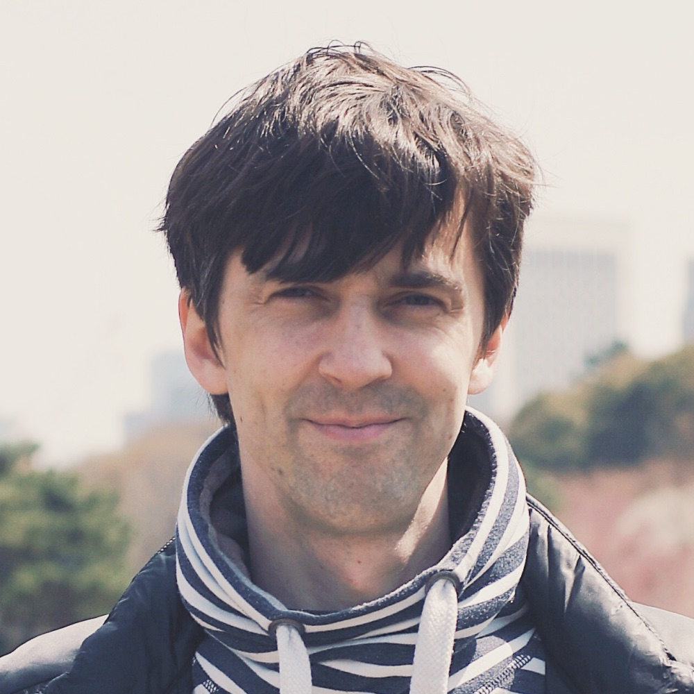

import Image from 'next/image'
import qrWa from './img/qr-wa.jpeg'
import qrTg from './img/qr-tg.jpeg'

 

# Anton Basistov

Hello! I am a **Product Designer** with a strong background in **UI/UX** and **Design Systems**. My focus area for the last few years has been professional aimed products with complex user scenarios. 

Last 5 years I worked as a product designer and design team leader at Sber, the biggest fintech company in Russia with 100K+ corporate and 3M+ SMB customers.

**Contact me:**

[+82 10-5946-6265](tel::+821059466265)

[basistov@gmail.com](mailto:basistov@gmail.com)

<a href="https://drive.google.com/file/d/1hqJ1tknfByFQi7vEZDIgui8CGMZhmunj/view?usp=sharing" title="Download PDF" target="_blank" rel="noopener noreferrer">Resume (PDF)</a>

---

## Work experience

### Design Team Leader at Sberbank, 2020 — 2022

I was responsible for product design and process in the SberTreasury products, in close collaboration with more than 5 development teams. As a leader I managed a team of 3-4 designers and dealt with issues of hiring and onboarding. Key responsibilities:

- UX and UI for product teams, UX-researches and tests,
- design system, components and guidelines,
- managing the design team, hiring and onboarding,
- design processes, reviews, QA.

### Product Designer at Sberbank, 2017 — 2020

Product Design Lead in SberBusiness and SberPro products. Key achievements:

- SberPro desktop app total redesign and launch,
- UX-researches and tests, interfaces,
- design processes, design system maintaining.

### Design Lab Head at **HSE Art & Design School, 2016 — 2017**

Head of the web department. Job responsibilities included the designing of websites and mobile applications for educational and commercial projects. 

- A teacher in the discipline of "Digital Product Design" (BFA + Postgraduate).
- Design and development of TimeTracker mobile app for iOS (students attendance and marks tracker).

### UIUX Designer at **MOSAIC, 2014 — 2016**

Digital and UI/UX designer at the advertising agency. Made web sites and mobile apps, user interfaces, identity, creative design. Worked on Nestle, Pepsi, Lays, Philip Morris, Škoda, Peugeot and other brands.

### Digital Designer at **.POST Studio, 2013 — 2014**

Design of sites, UI/UX, identity, graphics design.

---

## Education

### British Higher School of Art and Design

|     |     |     |
| --- | --- | --- |
| 2010—2011|   🎓 | Interactive and New Media |

### **Lomonosov Moscow State University**

|     |     |     |
| --- | --- | --- |
| 1997—2003 |   🎓 | Radiophysics and Telecommunications |

---

## Skills

- **User Experience**

  More than 10 years of experience at user interfaces for web and mobile. User’s workflow, information hierarchy, prototyping, quantitative and qualitative test.

- **Design Systems and Processes**

  I have experience creating design libraries, guidelines, and storybooks, as well as maintaining design processes for teams.

- **Team Leader**

  Design teams management, hiring and onboarding issues, cross-team collaboration experience, including meetups conducting. 

- **Coding**

  HTML/CSS/JS/Node — I can build layouts and frontend from scratch or using some modern frameworks.

---

## Feel free to contact me

[basistov@gmail.com](mailto:basistov@gmail.com)

[+82 10-5946-6265](tel::+821059466265)

<a href="https://drive.google.com/file/d/1hqJ1tknfByFQi7vEZDIgui8CGMZhmunj/view?usp=sharing" title="Download PDF" target="_blank" rel="noopener noreferrer">Resume (PDF)</a>

[LinkedIn](http://linkedin.com/in/basistov)

<aside class="no-bleed">
  <a href="https://wa.me/qr/BLE4J6UC3KPZM1" title="WhatsApp Contact" target="_blank" rel="noopener noreferrer">
    WhatsApp Contact
    <Image src={qrWa} alt="WhatsApp Contact" width={200} height={200} />
  </a>
</aside>

<aside class="no-bleed">
  <a href="https://t.me/basistov" title="Telegram Contact" target="_blank" rel="noopener noreferrer">
    Telegram Contact
    <Image src={qrTg} alt="Telegram Contact" width={200} height={200} />
  </a>
</aside>