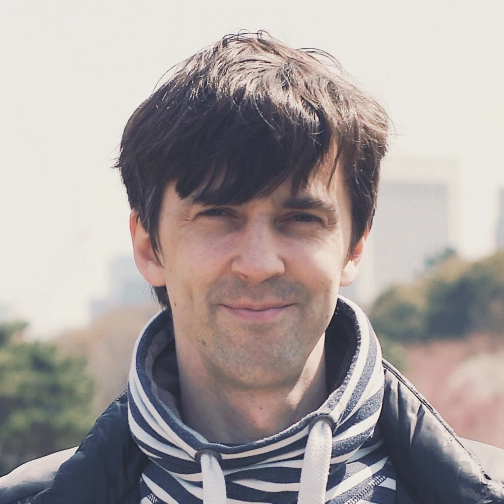

import Image from 'next/image'
import qrWa from './img/qr-wa.webp'
import qrTg from './img/qr-tg.webp'

 

# Anton Basistov

Hello! I am a **Senior Product Designer** & **Design Manager** with a strong background in **UI/UX**, **Design Systems** and **Frontend Development**. My focus area for the last few years has been professional aimed SaaS products with complex user scenarios.

**Contact me:**

[basistov@gmail.com](mailto:basistov@gmail.com)

---

## Work experience

### Product Design Lead at 01.tech, 2023 — 2025

Joining the team at the earliest MVP stage of a SaaS marketing automation system (CDP), I established the design process for both product and development teams. As a result:

- Improved consistency of UX patterns and interfaces;
- Organized a comprehensive Design System;
- Implemented a new Design Review and QA process, enhancing quality and speed;
- Developed a multilingual localization process;
- Fostered a culture of UX and product research within the teams.

### Design Team Leader at Sberbank, 2020 — 2022

Led a team of designers to deliver product features and a design system, covering needs of corporate users of large enterprises. 

- Provided components and guidelines for SberTreasury web service. 
- Performed and standardized design process across 7 dev teams. 
- Carried out UX research, layouts, components, reviews and QA. 
- Collaborated closely with stakeholders, product managers, developers (more than 7 teams), UX-researchers & marketing.

### Senior Product Designer at Sberbank, 2017 — 2020

Handled the entire redesign and launch of SberPro — desktop bank client app for large enterprises. 

- Defined the needs of users and translated into design.
- Tested and validated solutions to ensure best user experience. 
- Launched the app, completely redesigning UX around working with financial documents, ensuring a logical and convenient workflow.
- Reduced the need for customer support by 70%.
- SberPro took part in the Markswebb Digital Corporate Banking Rank in 2020 and directly helped Sberbank take 1st place.

### Design Lab Head at **HSE Art & Design School, 2016 — 2017**

Designed and developed an application for attendance and evaluation tracking for teachers, made websites and mobile apps in educational and commercial projects. **Worked as a teacher** for BFA and Postgraduate students majoring in Digital Product Design.

### UIUX Designer at **MOSAIC, 2014 — 2016**

Digital interactive and UX designer at the advertising agency. Designed web sites and mobile apps. Worked with Nestle, Pepsi, Škoda, Peugeot and other brands. Designed the key mobile app for MTS clients (the largest Russian mobile carrier) for iOS and Android, including smartphones and tablets.

---

## Education

### British Higher School of Art and Design

🎓  Interactive and New Media

### **Lomonosov Moscow State University**

🎓 Radiophysics and Telecommunications

---

## Skills

- **Team Leader**

  Design teams management, hiring and onboarding issues, cross-team collaboration experience, including meetups conducting. 

- **User Experience**

  More than 10 years of experience at user interfaces for web and mobile. User’s workflow, information hierarchy, prototyping, quantitative and qualitative test.

- **Design Systems and Processes**

  I have experience creating design libraries, guidelines, and storybooks, as well as maintaining design processes for teams.

- **Coding**

  HTML/CSS/JS/Node — I can build layouts and frontend from scratch or using some modern frameworks.

---

## Feel free to contact me

[basistov@gmail.com](mailto:basistov@gmail.com)

[LinkedIn](http://linkedin.com/in/basistov)

{ /*

<aside className="no-bleed">
  <a href="https://wa.me/qr/BLE4J6UC3KPZM1" title="WhatsApp Contact" target="_blank" rel="noopener noreferrer">
    WhatsApp Contact
    <Image src={qrWa} alt="WhatsApp Contact" width={200} height={200} />
  </a>
</aside>

<aside className="no-bleed">
  <a href="https://t.me/basistov" title="Telegram Contact" target="_blank" rel="noopener noreferrer">
    Telegram Contact
    <Image src={qrTg} alt="Telegram Contact" width={200} height={200} />
  </a>
</aside> 

*/}