import Image from 'next/image'

# SberBusiness treasurer dashboard

> SberBusiness is an online bank designed for business. While the majority of its users are small business owners, the website is also used by representatives of large businesses. 

The SberBusiness website adjusts to clients from various industries, such as rental business, transport, cargo transportation, and digital sales. It changes the site menu and the main page, which consists of a set of widgets. 

## Task
It was required to adjust the main page of the website to meet the needs of large business users such as accountants, treasurers, and financial directors.

It was decided to create dashboards similar to those of other industries. These dashboards will reflect the three key scenarios of large business users: **liquidity management**, **currency exchange** and **salary payments**. To achieve this I designed series of widgets and a variety of layout compositions.

## Liquidity management

  

    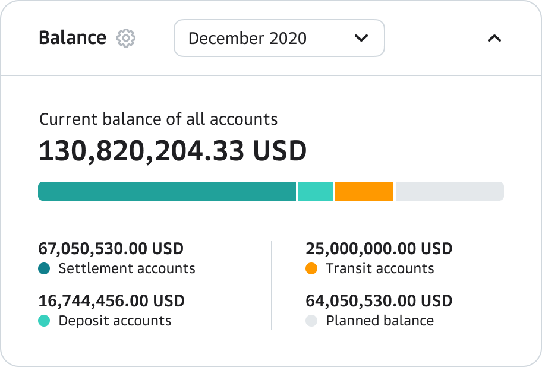
  

    

    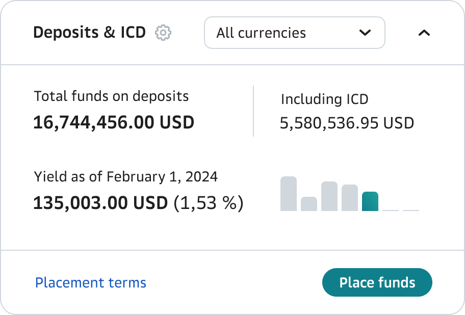
  

  

    
  

  

    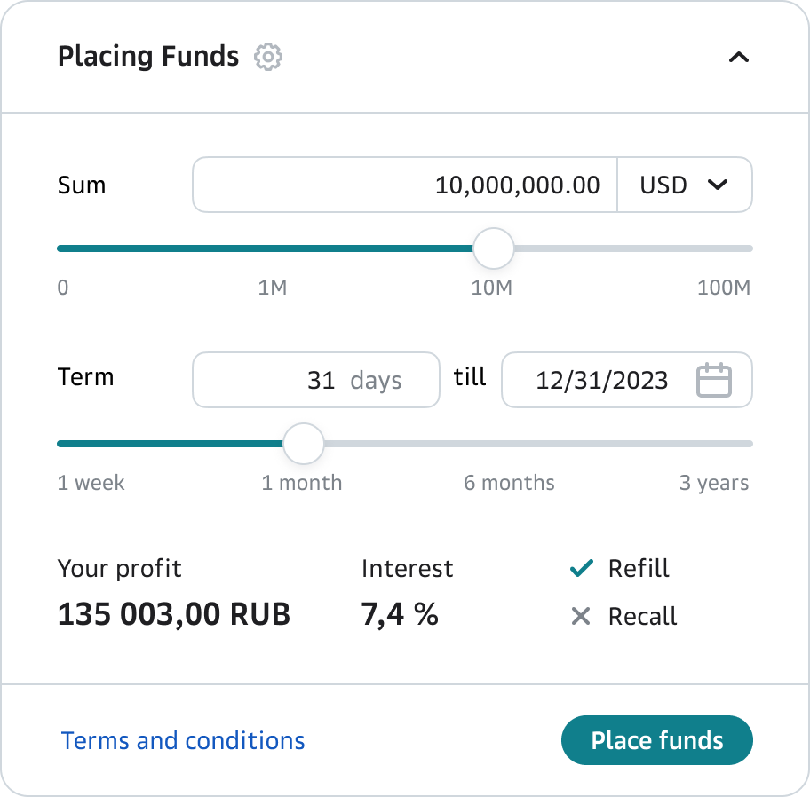
  

## Currency exchange

  

    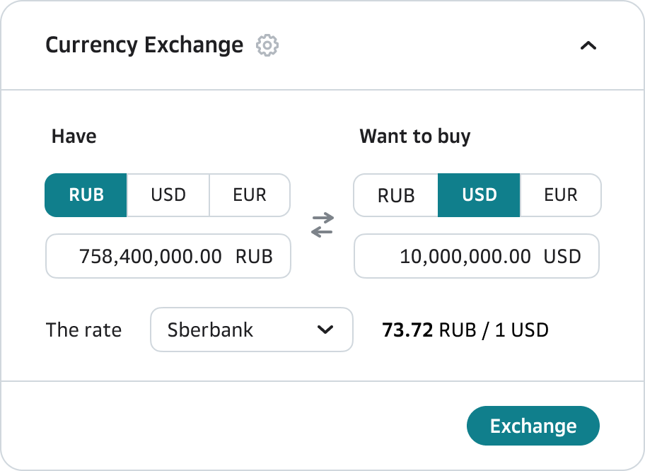
  

  

    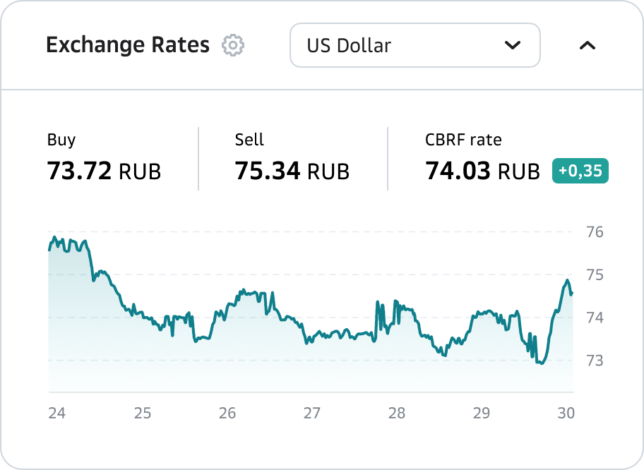
  

  

    
  

  

    
  

## Salary payments

  

    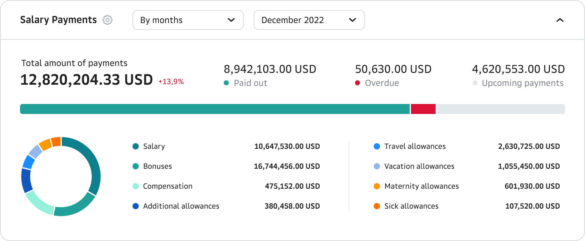
  

  

    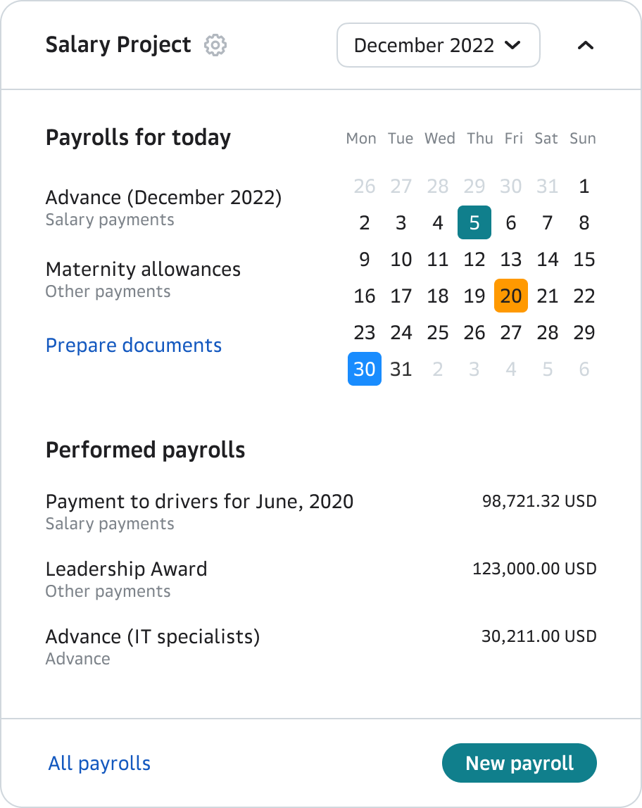
  

  

    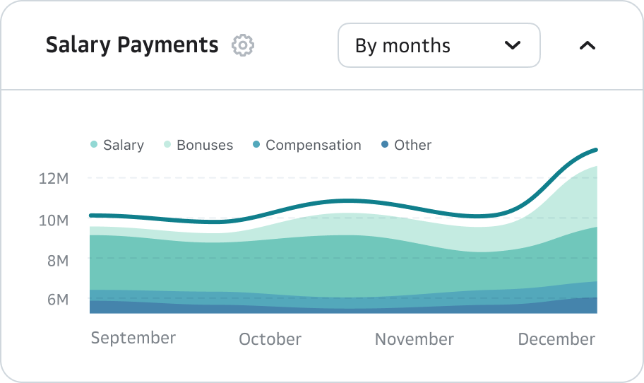

    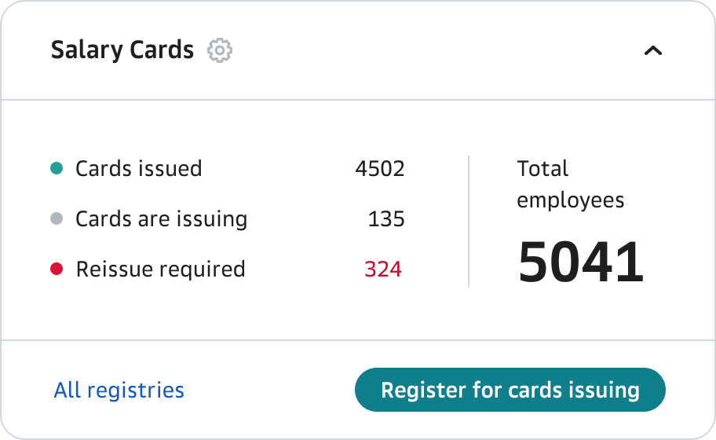
  

## General widgets for the main page

  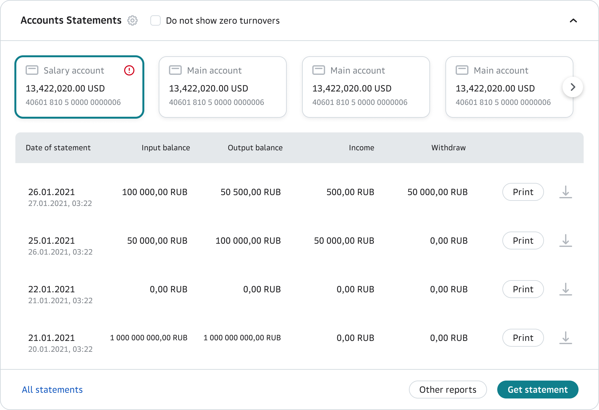

## Layout compositions

  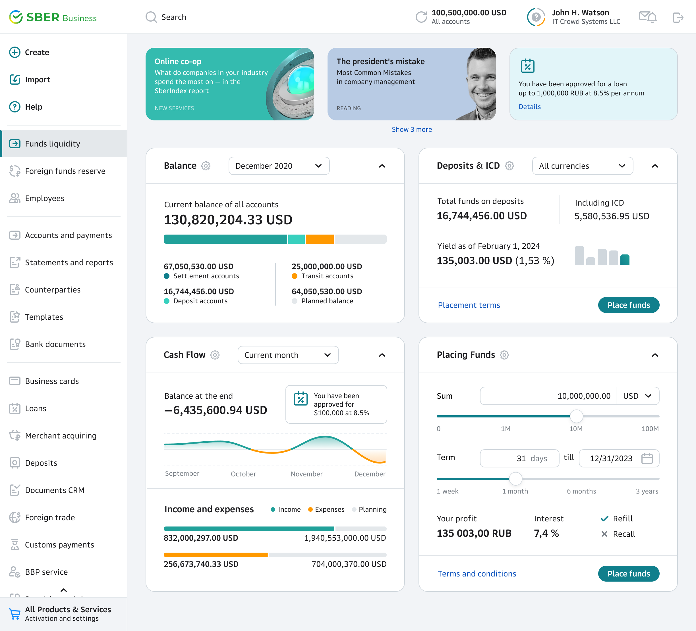

  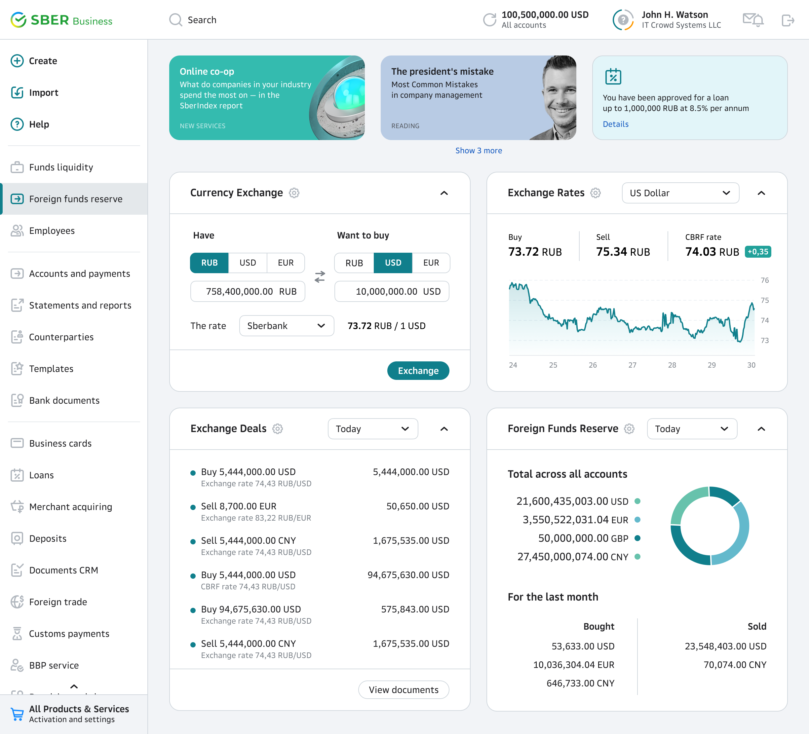

  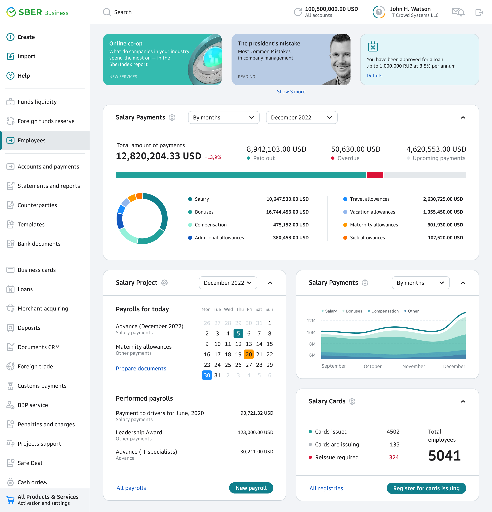

  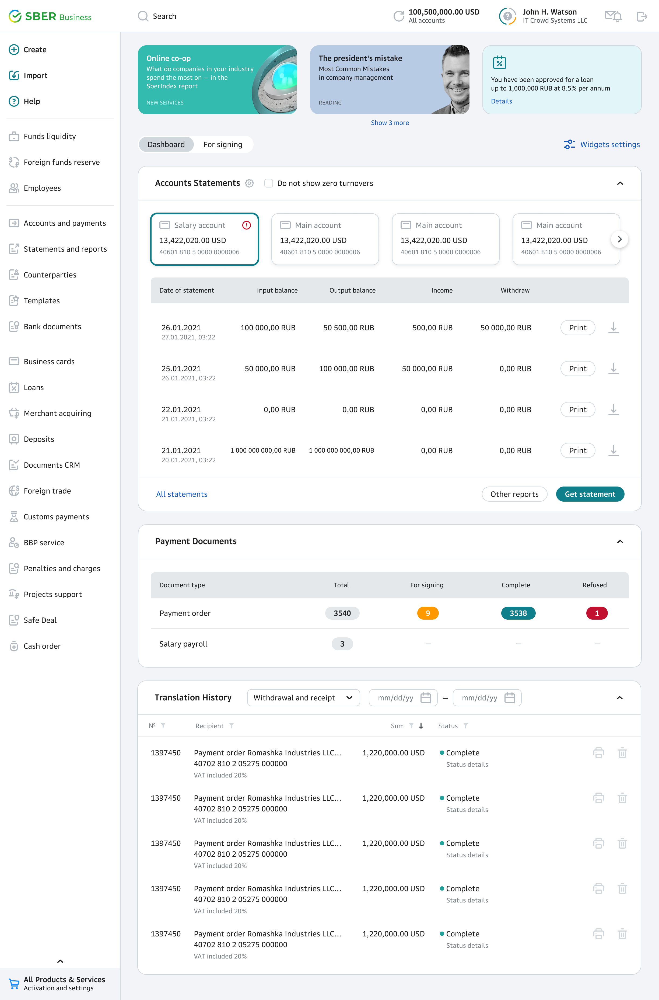

  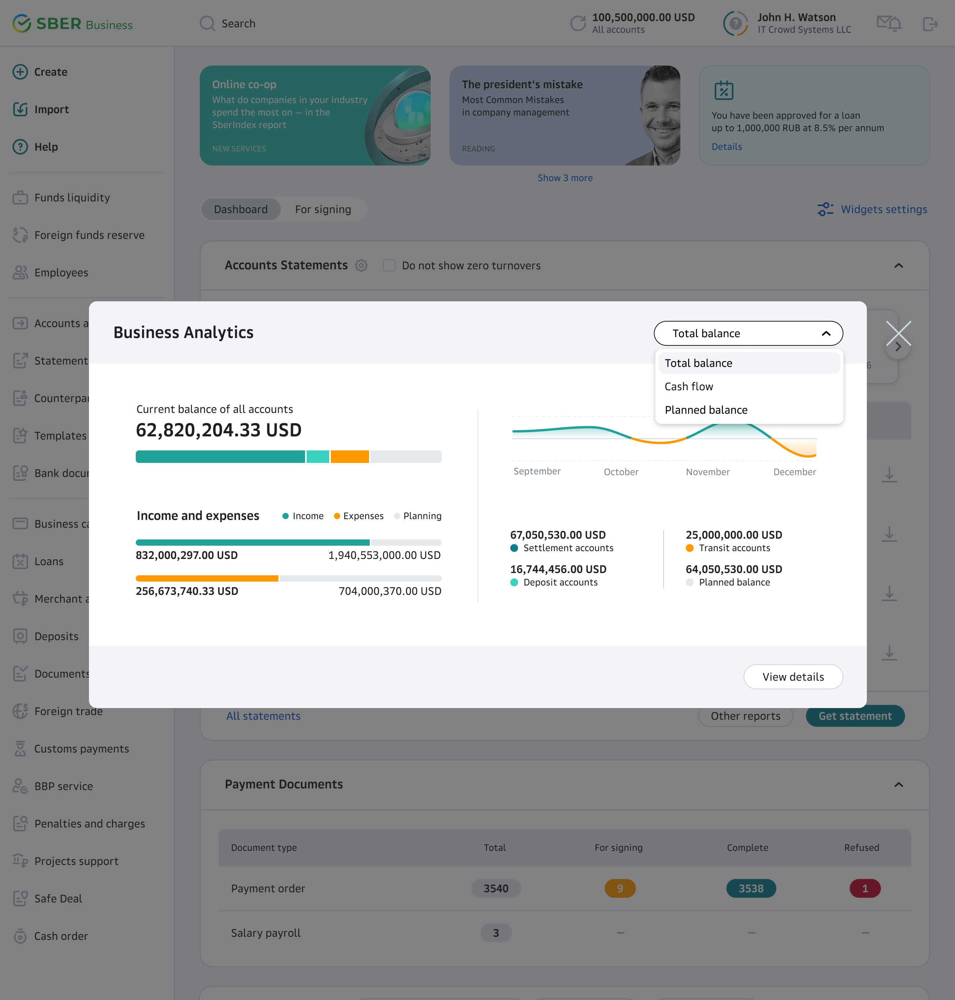

