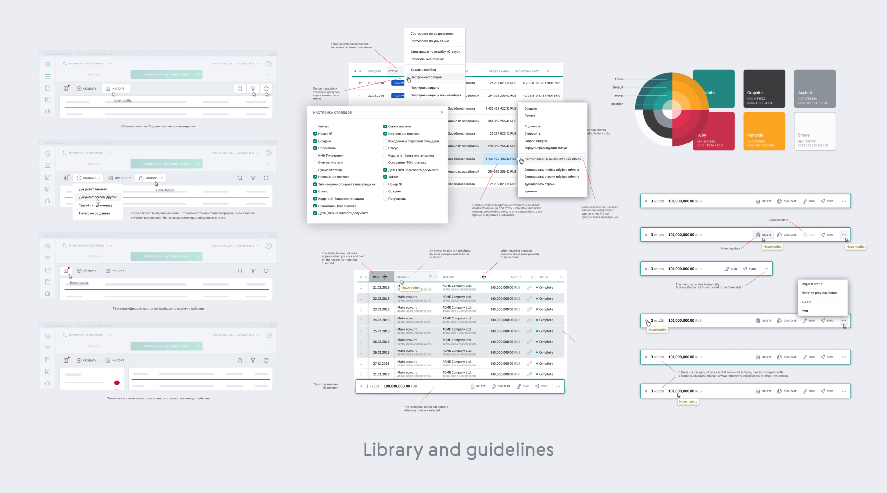

# SberPro desktop app redesign

<aside className="extra-margin">
💡 **Summary**

The old app had issues with productivity and UX. My role included UX research, UI layouts, design system and QA. The new app solved a lot of UX issues, including document views, improved tables, and widgets. Usability tests were conducted and the new app was successfuly released.

</aside>

SberPro — it is a desktop internet bank for customers of [SberBank](https://www.sberbank.com/), the largest Russian bank and ecosystem with 50M+ MAU. SberPro users are the largest enterprises in resource-extracting industries, heavy machinery, retail industry.

SberPro is an offline client, so all data is stored locally on the client side, and is synchronized during periodically established connections. Almost like a native email client does.

## The problem

The story began when support team gathered a large list of issues with software productivity and bugs. Such as:

- Slow app (up to an hour to send and receive documents).
- Complicated installation (IT-staff help needed).
- Old-fashioned UI, a lot of modal windows and non-intuitive UI-patterns.
- Low users productivity and UX issues.

These problems reduced the performance of client's accounting and treasury departments. Also the old application was too expensive to maintain and release new features. So, the only one right solution was **to make a new application**.

## My personal role

Working in tandem with my junior designer, I was responible for:

- **UX research, tests and prototypes**
    
    Research on technical specifications, user’s personas, workflow, hypotheses and test-cases for UX-tests.
    
- **Layouts and mockups, Design system, DesignOPs**
    
    Creation of design system and guidelines for the design process, collaboration with developer teams, providing training support.
    
- **QA and design review**
    
    Review of the production builds, helping teams to follow the guides and improve UI quality.
    

## UX research

First of all I started with UX research. During in-depth interviews with our key clients I saw our typical users at their workplaces.

Typical SberPro user’s environment

This is what I discovered about users:

- middle-aged women (30—50);
- accountants at large enterprises;
- spend a couple of hours daily with our software;
- the daily number of payments is up to thousand;
- the summary amounts of transactions up to $1M+ daily;
- “pro users” with large FHD screens and high information density.

## UX issues

With interviews feedback and after revision of the old application, I discovered some UX issues, which were important to be solved in the new app. Here are the main issues:

- A lot of modal windows block the interface.
- Documents are divided into several tabs (complicated view and edit process).
- Excessive notifications and unnecesary information, lack of aggregating data.

Here are some examples:

Documents are opened in modal windows and block other content. There is a blurred background there, user’s unable to read the bottom layer. This is a problem when user needs to compare documents or to copy and paste data.

Also the document’s layout is divided into tabs. Important information is presented on several tabs, so the user has to switch between them. It becomes a real problem when you need to fill in one tab based on the information provided in others.

And there is some notification mess. During communication sessions hundreds of documents are being sent and received.

Yellow badges tell that some documents are updated. Bold font in the table shows which documents are updated. Also we have notification bubbles, every updated document produces the notification even if there isn’t any error. It is really hard to see which documents require attention. This produces a lot of excessive information for user.

## User’s workflow

Next I discovered the workflow of the user’s regular workday. At first documents are imported from the ERP to SberPro and checked for consistency.

> The key difference between SberPro and any other internet bank client is that large enterprises have their document management in ERP systems and use bank client software as transport tool.

After that, the package of documents is sent to the bank. After what sometimes takes up to several hours, the response data about the package and the bank statements arrives. The response data is checked for errors and the statements are exported back into ERP system.

If errors occur, the user corrects the documents in the ERP system and sends them again, or (if there are a lot of errors) the whole package of documents is reimported from ERP.

## Prototyping

My next step was wireframing. I made an interactive prototype in order to discover what the new layout should be. That prototype was tested with our users. Users found it familiar.

<video autoplay="true" muted="true" loop="true" playsinline="true">
    <source src="/static/sberpro/proto.mp4" type="video/mp4" />
</video>
<a href="/static/sberpro/index.html" target="_blank">You can check this prototype in browser.</a>

After that I prepared several variants of new UI style. We had brainstorming with our stakeholders and marketing team, and the final UI-style was chosen.

## UX improvements

Besides the new UI and layout, I solved some UX issues. Here are some improvements which I made:

- Documents are opened in tabs instead of modal windows.
- New document’s form layout without inner tabs.
- New tables with filters and context actions on records.
- Widgets which can aggregate information.
- Improved syncronization scenario and error handling.

The issue of blocking modal windows and document’s tabs was solved. Now all documents can be opened in separate tabs and edited simultaneously. And they don’t have inner tabs, just regular scroll and some accordions.

Tables also were improved. Now they have filter-tags, showing which filters were applied, they have search bar and new context actions bar at the bottom. This helps to clean up top menu. Now there are only general actions at the top. Context actions, which can be applied only to the selected records in the table, are at the bottom bar.

Also I made widgets, which can aggregate information about the documents (statuses, for example). And I designed a brand new communication session widget.

I got rid of the notifications about every single document, as well as of bold font in tables. Now the detailed information about every meaningful status is shown in widgets. Red color indicates the errors the user should deal with.

> The key idea — users don't really need to know about all documents, which changed their status. Moreover, they don't need to know about every particular error. The most important information for users is if errors occur or not. If there aren't errors, users need to check if all payments have been processed. If there are errors, user used to select all incorrect documents and reimport them.

Here are two widgets — the left one for all documents’ types, and the right one for the particular documents’ table. These widgets are interactive. User can click any status and open the table with that particular documents filtered by that status, and then do any desired multiple action.

## The design system

I made a complete design library, and guidelines for developers. New application was build on the new framework and component library, so I had to redesign every atomic component and provide guidelines for them.

## Usability tests

After the release of the first MVP version, we conducted usability tests with an external UX-research agency. I personally participated in the preparation of UX hypotheses and test cases. Most of them were related to the synchronization process and the functions of sending and receiving documents.

Our respondents were **10 users** from **10 different SMB companies**, large enterprises and state-owned enterprises. With the help of our product owners, I defined several hypotheses that are relevant to the main user’s workflow and prepared test cases for them.

Here are the results. You can see that users mostly had problems with the synchronization functions. In fact, there were two kinds of problems: users could not clearly understand the names of menu items and could not understand the specifics of the bank's processes. The main reason is the lack of onboarding. Those users who worked with the previous version of SberPro successfully passed the test.

Also some users paid attention to widgets and found them convenient. The main problem with this feature was that users did not understand the meaning of the word "widget", and the position of the buttons that opened the widget panels was difficult to find. It indicated the necessity of onboarding for new users.

## Achievements

What we achieved:

- New application is faster, users’ work is more productive.
- Some usability issues were solved.
- Improved installation process contains 2 times less steps.
- In the course of 2 years all the users switched to the new version. The old one was discontinued.
- Users love the new version.

## Conclusion

The large scale of the product and number of teams involved in development process made this case very complicated and interesting for me. I’ve learnt how to create design systems and tune on design processes in developers team, how to hire and lead designers, how to deal with legacy features and constraints. This project was a great experience in my career.