# SberBusiness universal app adaptation for tablet devices

SberBusiness — is bank client mobile app for legal entities and entrepreneurs. It exists in three forms — for Web,  iOS and Android platform.

## The issue

The SberBusiness mobile app is a simple and convenient way to manage your organization's finances. Some users prefer to run the app on tablets. Unfortunately, the layout of the application is not adapted for such devices.

## The solution

My suggestion is the concept of how the application should adapt to tablet devices and effectively use the possibilities of a larger screen.

The concept takes into account the possibility of creating a single universal application that runs on both smartphones and tablets and flexibly adapts to screen size. Thus I determine four basic layout configurations. 

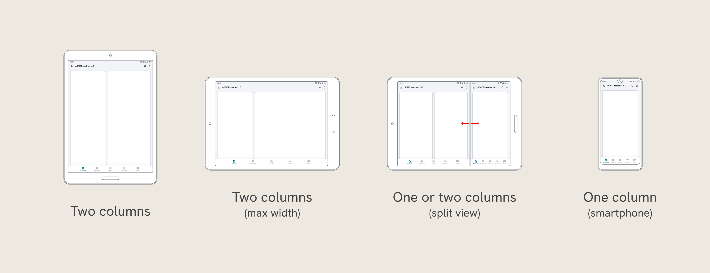

## The result

To present the concept, I have chosen several of the most important screens: the main screen, the list of documents and the payment form.

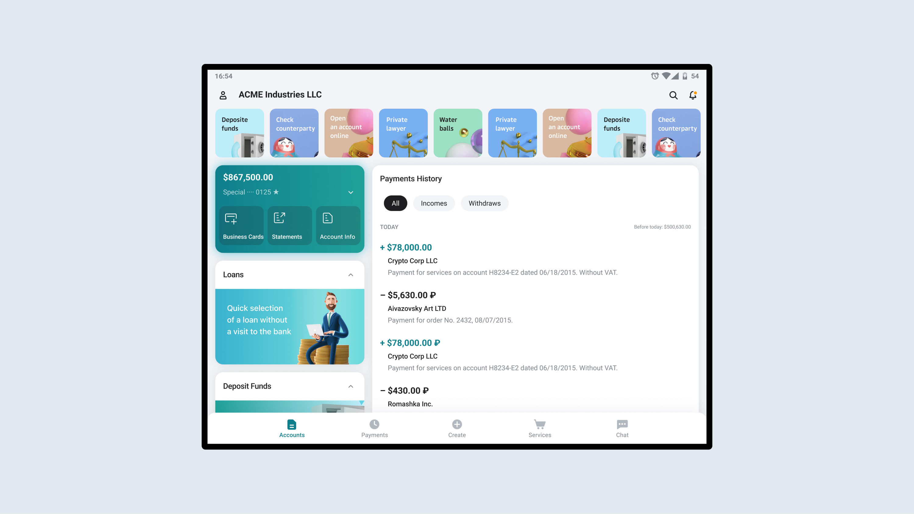

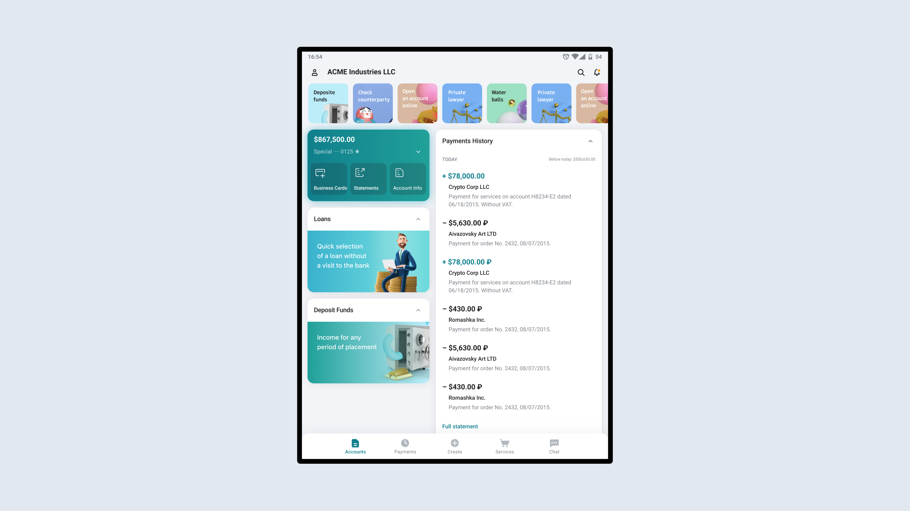

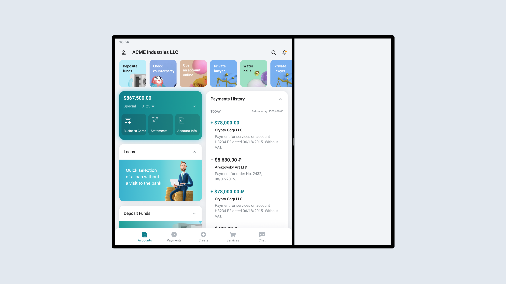

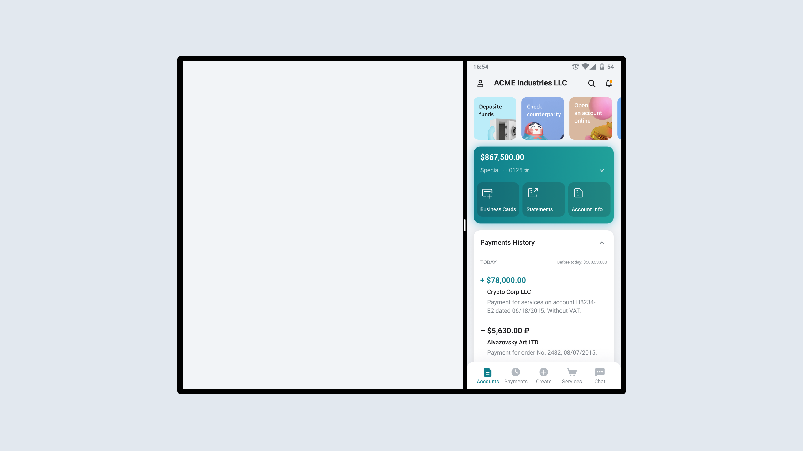

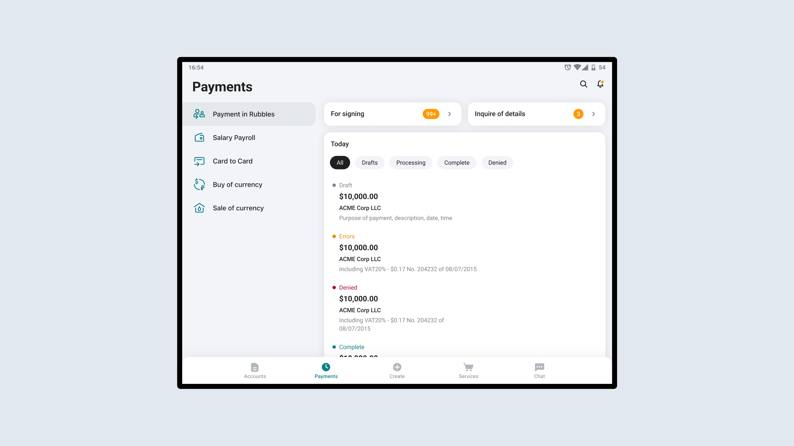

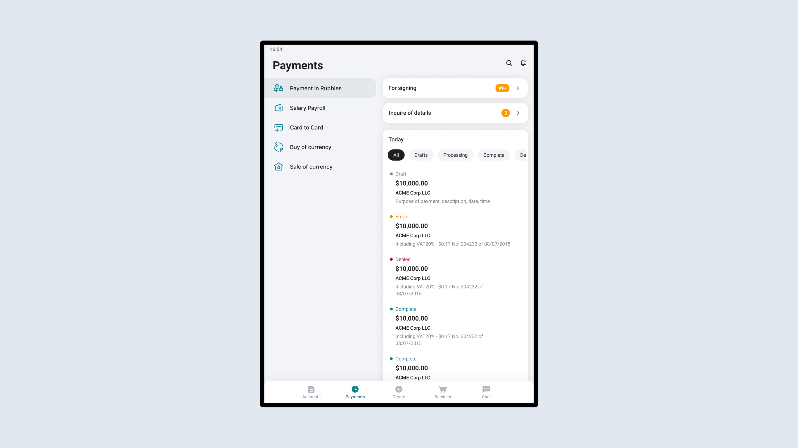

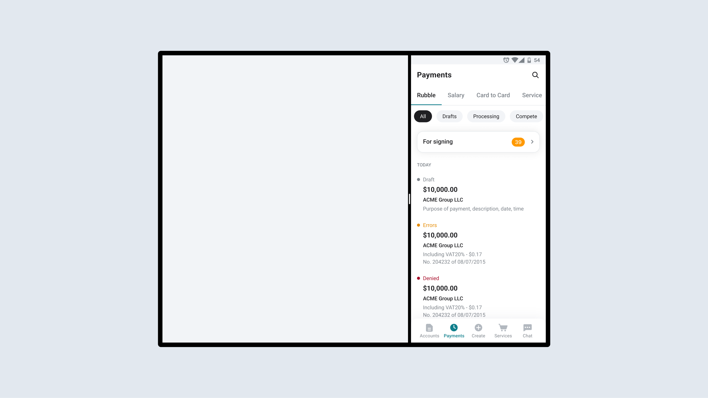

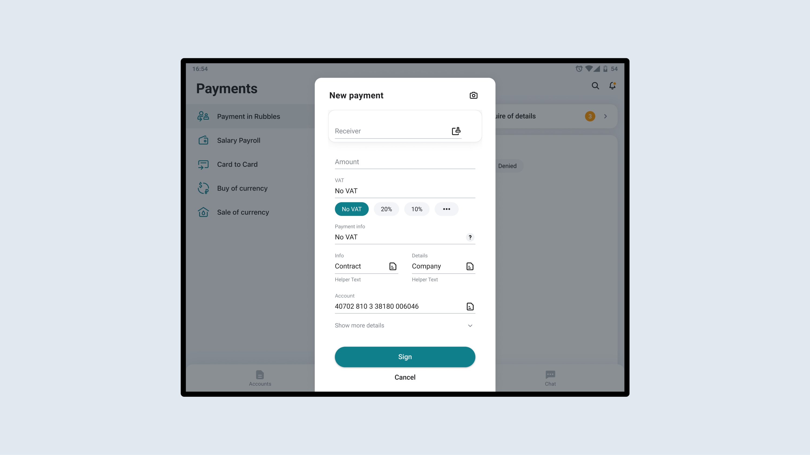

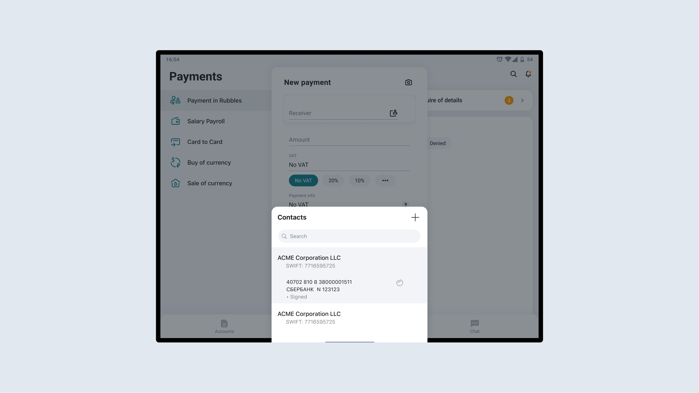

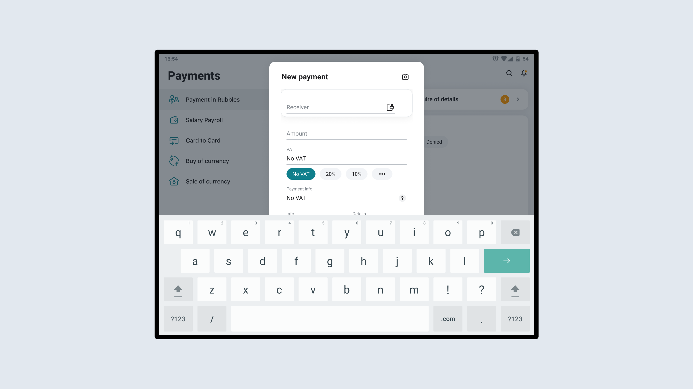

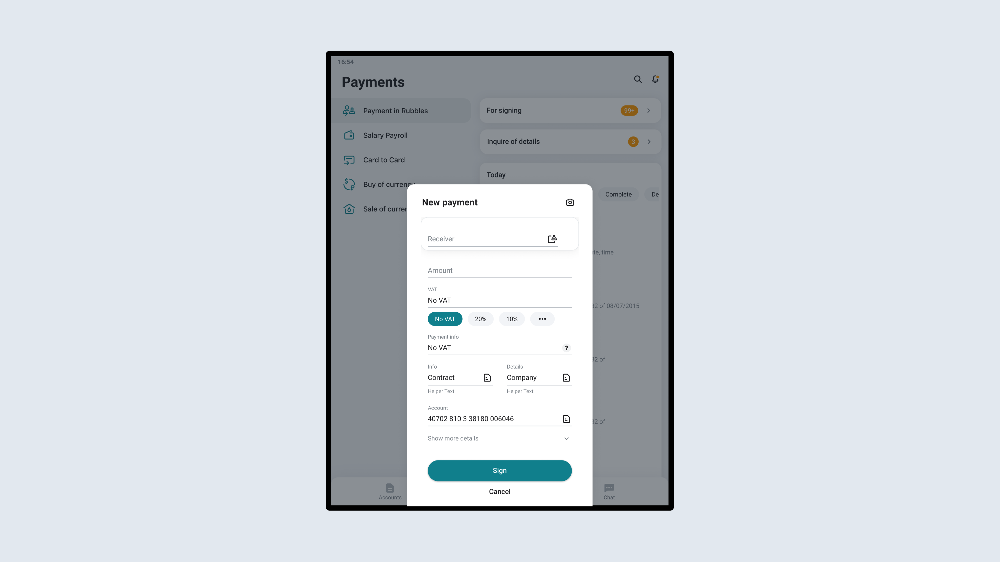

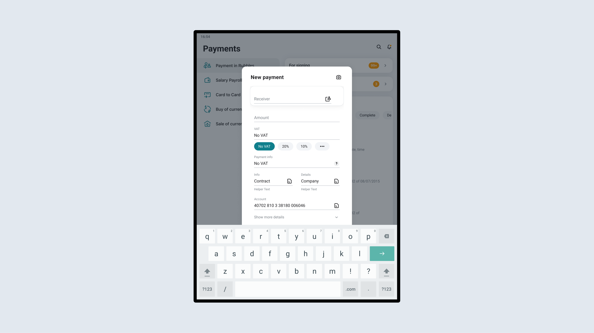