# Toxicity

Toxicity is an application designed to enable users to participate in the World Annoyance Championship. Imagine a parallel universe where annoyance is a matter of pride.

### The Goal

Our objective is to empower inhabitants of this universe to track their progress, observe their competitors, and monitor the gap until they receive the prestigious Chief Annoyance Cup.

Our target audience is individuals aged between 15 and 35 who are committed to a toxic lifestyle. The audience is comprised of 65% men, 33% women, with the remaining percentage identifying as non-binary. Users are social, active, and have a competitive spirit.

### Design Process

1. [Discover](#discover)
2. [Data Model Analysis](#data-model-analysis)
3. [Define](#define)
4. [Informational Architecture](#informational-architecture)
5. [Prototyping](#prototyping)
6. [Handoff](#handoff)
8. [Hypotheses and Tests](#evaluating-effectiveness-hypotheses)

---

## Discover

### Assumptions

- Given the audience's preferences, **a mobile app** is the most convenient platform. Because of:
	- user demographics,
	- convenience and accessibility,
	- real-time data,
	- passive data collection,
	- push notifications.
- Annoyance data is consistently gathered and analyzed **multiple times daily**.
- The app collects annoyance data **in the background** without user involvement.

### Competitive Analysis

Based on the app's nature, it is reasonable to assume that it would resemble many other progress-tracking and goal-oriented apps. For instance, I've taken fitness trackers as an example.

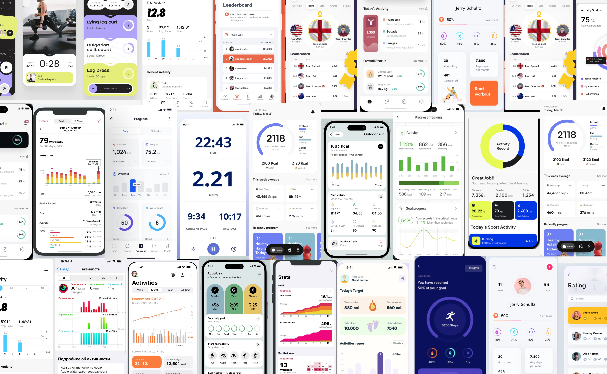

Here is a list of primary features common to such apps:

- Achievements of the current day
- Achievement dynamics over time
- The ability to monitor consistency of achievements
- The ability to set goals and see progress towards them
- Motivational advice
- Various statistical analysis options

It seems that all these functions could be beneficial for our app.

## Data Model Analysis

Now let's analyze the provided data. It appears the data table is not exhaustive, and I may supplement it with additional information usually gathered in such cases.

Here are some assumptions based on data analysis:

- The contest has just started and is ongoing (as there are only a few participants, and some have only annoyed 1-2 people).
- Annoyance Rating Score is an absolute number for a specific individual and does not depend on the user's location.
- As the Annoyance Rating Score doesn't fully correlate with the number of annoyed people, there must be other factors impacting the final result. Such factors could include:
    - The method of actively annoying people.
    - The level of passive annoyance — a user's ability to annoy their surrounding environment, which contributes to the rating regardless of the number of annoyed individuals.

### Additional Data

Assuming we can enrich the given data, here are some variables that could be used:

- User's gender
- User's age
- Efficiency of annoying, which is specific annoyance (rating / number of people). Let's call it — **Maliciousness**.
- Daily progress
    - Rating change for today
    - Number of people annoyed today
    - Level of passive annoyance

### Data analysis 

Now, we can analyze these data in numerous ways. Here are some metrics and visualization methods that might be interesting to the user:

- Annoyance score (absolute rating)
- Number of annoyed people
- Maliciousness (rating / number of people)
- Annoyance rate (people/day)
- Position in the overall ranking
- Position in the local country/city ranking
- Parameters increase for today
- Position at the end of the day ranking
- Goals (how many more people need to be annoyed to maintain the result)
- Ratio of passive to active annoyance

Some metrics depends on other dimensional data in terms of filtration. There are different finalists' lists, such as:

- Top overall
- Top in country
- Top in city
- Top in specific gender group
- Top on a particular day

Also, there could be multidimensional filtration:
- Top in a particular city AND in a specific gender group

### Visualization Methods

- **Primary parameters:** rating, progress, number of annoyed people, and efficiency.
- **Annoyance Rings:** Shows the current level of annoyance relative to a set goal. This helps users see how close they are to achieving their objectives, thus stimulating their motivation.
- **Personal Goals:** The system can automatically calculate annoyance goals, considering the user's competitors progress.
- **Time Chart:** Shows how the annoyance rating has changed over time. This allows users to see when they were most annoying and which days they need to ramp up their annoyance.
- **Cumulative Progress Chart:** Helps users to visualize the dynamics of their rating increase and the deviation from their set goals.
- **Leaderboards:** A classic method to foster competition and motivation. Leaderboards can be global, or divided by country or city.
- **Daily Leaderboards.**
- **Heatmap of Results:** Displays geographical regions with the highest levels of annoyance, enabling users to compare their results with others in their area or country.
- **Gender/Age Analytics:** a heatmap of annoyance efficiency based on gender and age.
- **Country rankings** (most annoying country).
- **Popular annoyance methods.**
- **Reminders:** such as "You haven't annoyed anyone today."
- **A series of hints:** like "Some annoying tips to increase your annoyance."

## Define 

The next step is to identify key user goals and main scenarios. To achieve this, we will use the Value Proposition Canvas method.

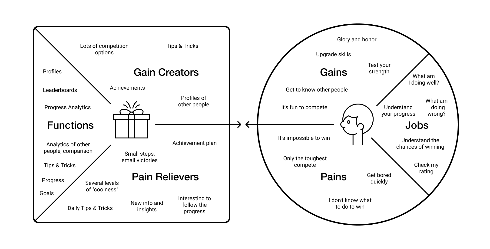

Key goals include the following:

- Learn one's rating and position.
- See one's progress and chances of winning.
- Analyze achievements to strategize improvement.

This helps us form 3 key scenarios:

### Scenario 1

1. Open the application.
2. Check one's rating.
3. View the leaderboard and find out one's place on it.
4. Understand how much progress is left until victory.
5. See additional rankings by country and city.

### Scenario 2

1. Open the application.
2. Check one's rating.
3. Understand how it has changed in a day.
4. Assess one's progress.
5. Understand what needs to be done to improve.
6. View the day's final rating.

### Scenario 3

1. Open the application.
2. Check one's rating.
3. Find people with similar ratings.
4. View a profile.
5. Study overall user and country statistics.

## Informational Architecture

The next step is to sketch out a schematic structure of the application with a map of possible transitions.

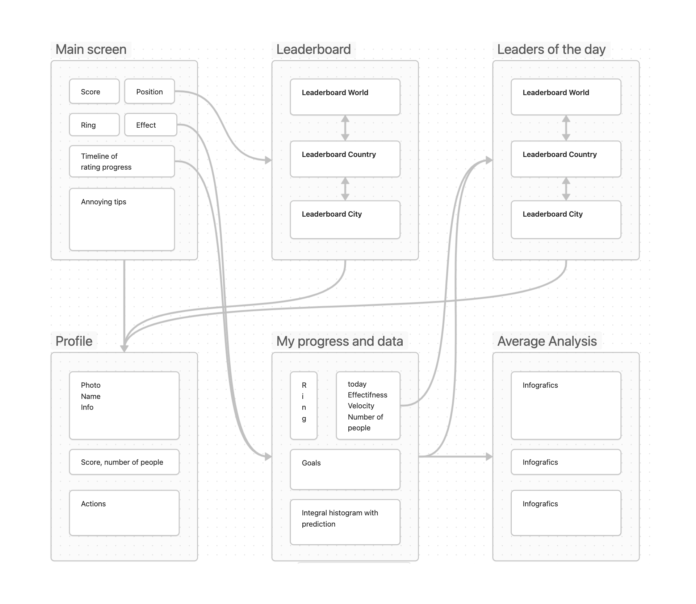

## Prototyping

Given that this is a test task, I'm skipping the wireframing phase and various usability tests, proceeding directly to prototyping in the final UI. Since the Semrush library doesn't contain components for mobile platforms, they'll have to be created from scratch. However, I'll strive to maintain the general style, colors, and typography.

  

    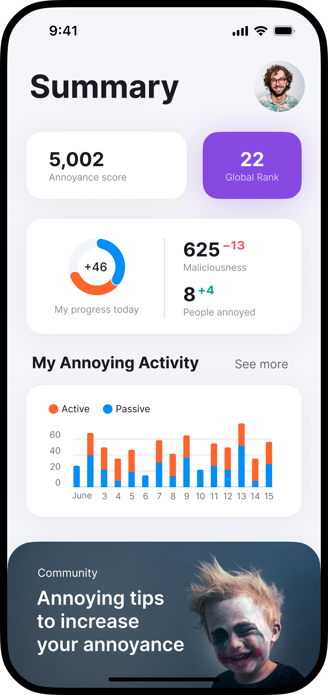
  

  

    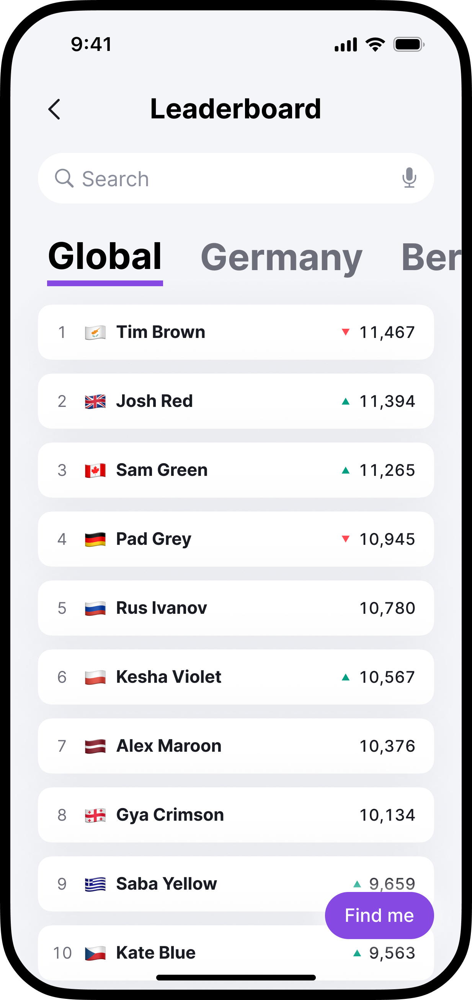
  

  

    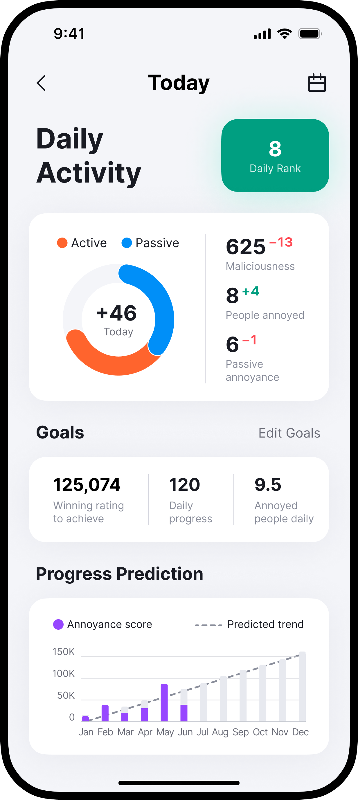
  

  

    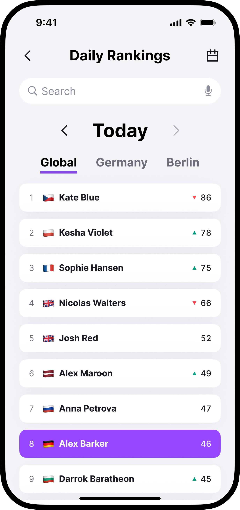
  

  

    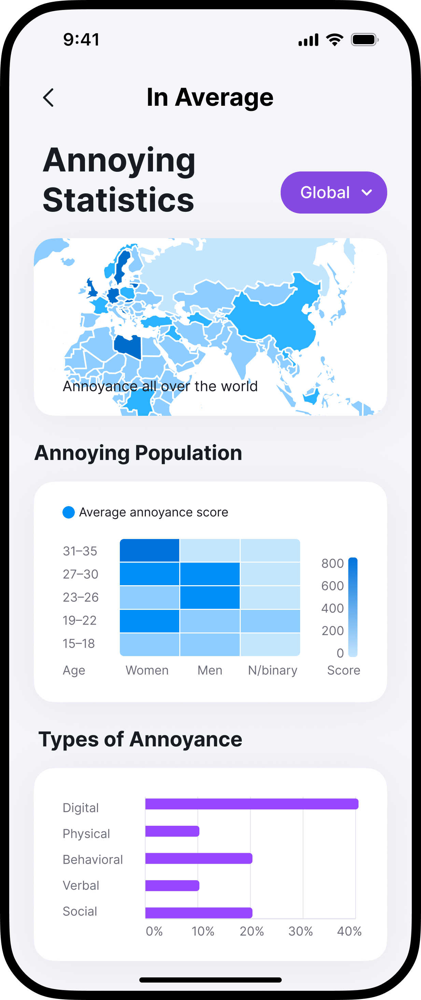
  

  

    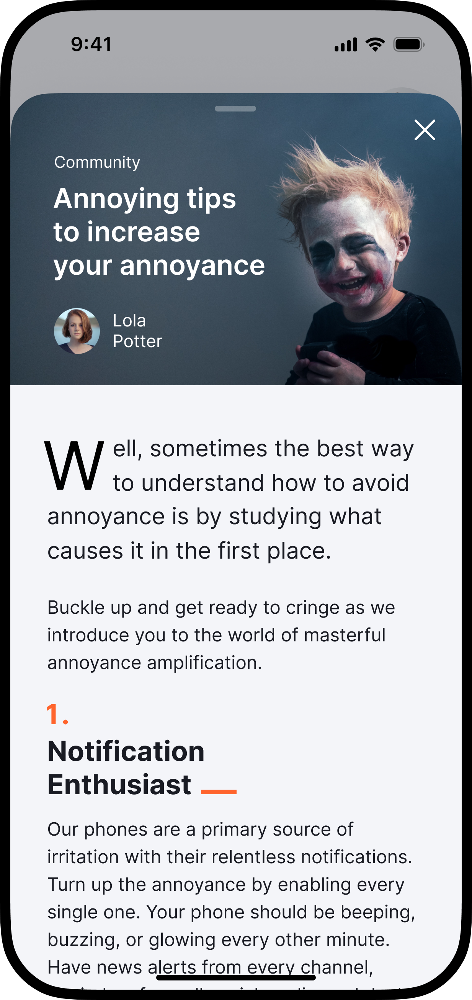
  

  

    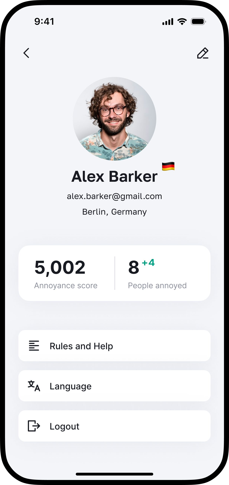
  

  

    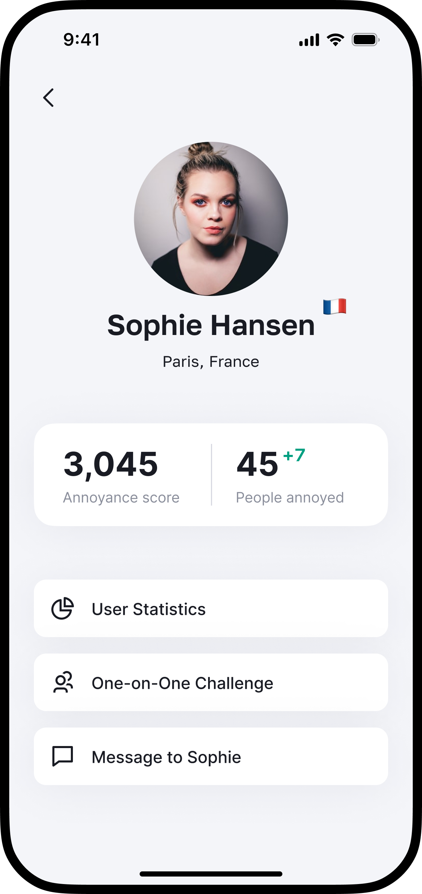
  

For ease of working on layouts, I used the **Google Sheets Sync** plugin, which allows you to fill in layouts with real data from the provided table in a convenient way.

By the way, [check prototype!](https://www.figma.com/proto/GFYS4X9s3yBYo4avPvFR2k/Semrush?page-id=0%3A1&type=design&node-id=11-823&viewport=285%2C266%2C0.13&scaling=scale-down&starting-point-node-id=11%3A823&hide-ui=1)

## Handoff

To ready the design for development, it's important to include these essentials:

1. **State cases:** Depict all possible states - empty, loading, error, hover, filled, etc.
2. **Edge cases:** Show how the design handles extreme situations like long text or data scarcity.
3. **Screenflows & interactive prototype:** Highlight navigation paths and interactions in the app.
4. **UI kit & component guidelines:** Provide a clear guide for implementing the design elements.

Here are examples of design documents. Also you can check [Figma File](https://www.figma.com/file/GFYS4X9s3yBYo4avPvFR2k/Semrush?type=design&node-id=0%3A1&t=SED4fCX34uvIOjq7-1).

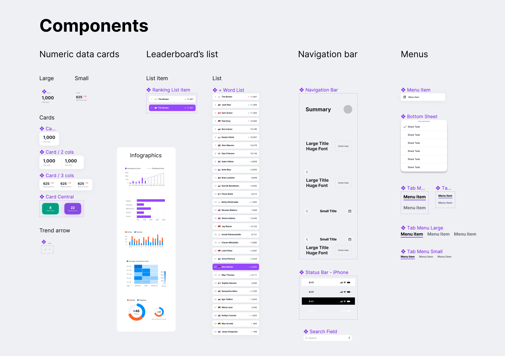

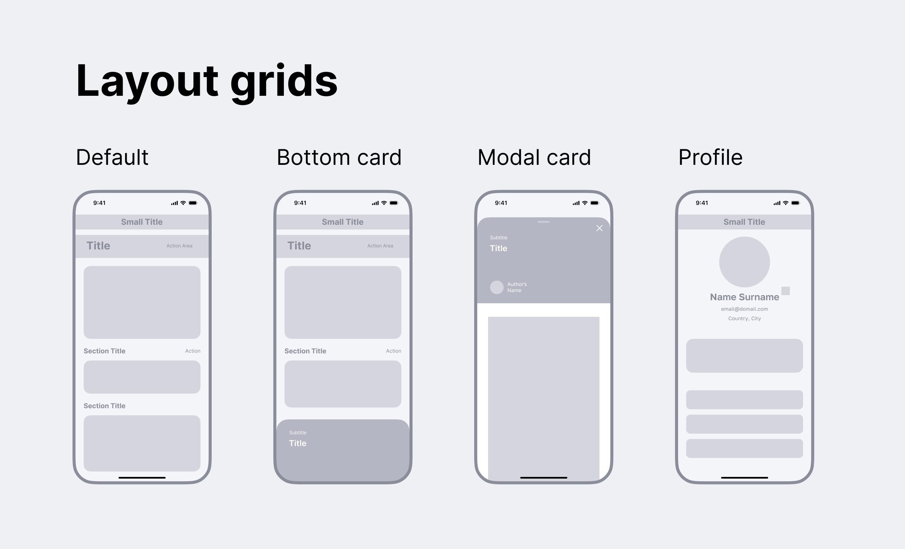

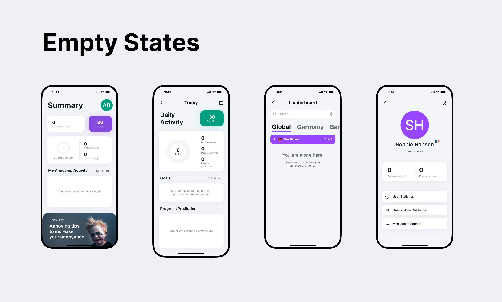

## Evaluating Effectiveness Hypotheses

Since we skipped the prototype testing stage, it's crucial to establish hypotheses for assessing UI and UX quality. Some potential hypotheses might be:

1. **Users value understanding daily progress and winning daily competitions.**
   
   Test (GA):
    - Percentage of users accessing the app daily.
    - Percentage of users utilizing the "Activity" screen.
    - The number of "Activity" screen views relative to others.
      
2. **Users are interested in learning about other users.** 
   
   Test (GA):
    - Percentage of users delving into other users' profiles.
      
3. **Seeing one's position on the main page isn't enough; users want to see themselves in the ranking table.** 
   
   Test (GA):
    - Percentage of users clicking the "Find me" button.
    - Percentage of users scrolling down to their position.
      
4. **Users are interested in reading tips to boost their performance.** 
   
   Test (GA):
    - Percentage of users clicking on advice cards.
      
5. **Daily victories stimulate self-improvement and engagement.** 
   
   Test (Backend + GA):
    - Track correlation between users achieving high daily ranking positions and an increase in their app usage.
      
6. **The automatic prediction system and goal-setting function benefit the user.** 
   
   Test (A/B):
    - Create an app version without the prediction system and compare user group results with similar profiles.

## Conclusion

In conclusion, the proposed design prioritizes user engagement and competition. However, without prototype testing, it's essential to carefully evaluate these design choices using established hypotheses. The value of this design will ultimately be verified by user response and behavior.

